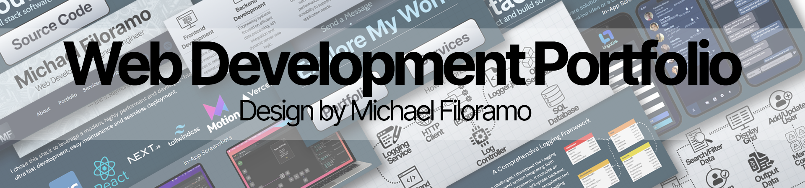
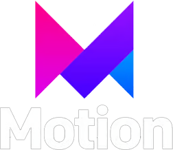
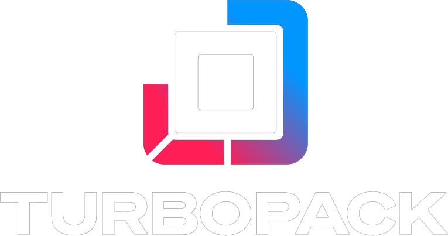

<h3 align="center" style="margin-top: 0;">This is a portfolio highlighting my favorite work in web development, as well as information about who I am and the services I offer. You can visit the site <a href="https://michael-filoramo.com">here</a>. Feel free to peruse through the source code!</h4>

  
  
  

## Introduction
Welcome to my Web Development Portfolio! This portfolio showcases a collection of my favorite projects, highlighting my skills in full stack web development and various modern web technologies. It serves as a window into my journey in software development, featuring both client projects and personal endeavors that illustrate my passion for creating responsive, user-friendly websites and applications. Dive in to explore my work, learn about the technologies I use, and discover how I can bring your digital visions to life.

## Technology Stack

  
  
  
  
  
  
  
  

